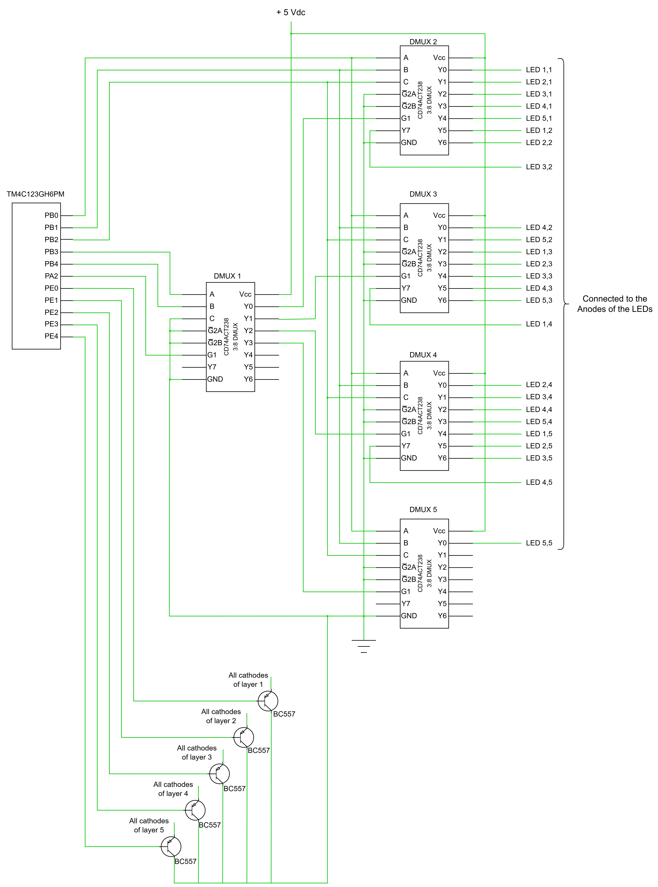

# Introduction 
This project utilizes the Texas Instruments TM4C123GH6PM microcontroller to control 
and display 3D animations on a 5x5x5 LED Cube matrix. Demultiplexers were utilized to 
minimize the number of microcontroller resources used. Various animations were coded in 
C using Keil uVision and downloaded on the TM3C123GH6PM Tiva LaunchPad. 

# Background and Methodology 
This project utilizes the built in GPIO module on the TM4C123GH6PM to control the 5x5x5 
LED cube. The 5x5x5 LED cube has 25 vertical columns and 5 horizontal layers. The anodes 
of the LEDs in each vertical column are all connected together, and the cathodes of the 
LEDs on each horizontal layer are all connected to each other, which are each connected 
to BJT transistors, which are used to handle the switching of the cathodes. 

11 GPIO pins are used, 5 pins to control the anodes of the LEDs through a demultiplexer 
circuit, 5 pins to control the Cathodes of the LEDs by connecting to the base pins of the 
BJTs, and 1 pin to enable and disable the demultiplexer circuit. The demultiplexer circuit 
consists of 5 3:8 decoders configured to work as a 5:32 demultiplexer. Instead of using 25 
pins to control the anodes of the LEDs, only 6 pins are used with the demultiplexer circuit. 
The concept of PWM is used to control the brightness of the LEDs, however this is done through 
controlling the GPIO pin using a delay function, which is based on the SysTick module of the MCU. 
The PWM module is not used. This GPIO pin is the one connected to the enable pin of the 5:32 
demultiplexer. 

Since demultiplexers can only have one output HIGH at any given time, a function (LED_Control) 
had to be developed to quickly toggle each LED in a frame of the animation one at a time to 
give off the illusion that more than one LED is on at the same time. This speed at which the 
LEDs toggle is fast enough such that the human eye cannot detect the blinking effect. This was 
done by toggling the PA2 pin, which enables and disables the 5:32 DMUX circuit.  

To code each animation, each frame of the animation was individually in arrays, which contain 
the hex values for the anodes and cathodes of the LEDs, then each frame is passed on to the 
LED_Control function mentioned previously, which displays the respective LEDs for a certain 
duration at a specified brightness level. By creating multiple frames and calling the LED_Control 
function to run the frames, animations were created. 

# Block Diagram

# Components Used 
| Description                       | Quantity  | Manufacturer      |
| --------------------------------- | --------- | ----------------- |
| Tica C Series TM4C123G Launchpad  | 1         | Texas Instruments |      
| USB-A to Micro-USB cable          | 1         | N/A               |
|USB-A to Micro-USB cable           | 1         | N/A               |
|125 Green LEDs                     | 1         | N/A               |
|BC557 PNP transistors              | 5         | N/A               |
|CD74ACT238 3:8 DMUX                | 5         |Texas Instruments  | 
|Breadboard                         | 1         | N/A               |
|Jumper wires                       | N/A       | N/A               |

# Pinout
| TM4C123G LaunchPad Pin    | 5x5x5 LED cube and 5:32 DMUX circuit  |
| ------------------------- | ------------------------------------- |
| PB0                       | DMUX 2-5 - input A                    |
| PB1                       | DMUX 2-5 - input B                    |
| PB2                       | DMUX 2-5 - input C                    |
| PB3                       | DMUX 1 - input 1                      |
| PB4                       | DMUX 1 - input 2                      |
| PE0                       | Layer 1 BJT base                      |
| PE1                       | Layer 2 BJT base                      |
| PE2                       | Layer 3 BJT base                      |
| PE3                       | Layer 4 BJT base                      |
| PE4                       | Layer 5 BJT base                      |
| PA2                       | DMUX 1 - G1 pin                       |

# Schematic

# Analysis and Results
The result of this experiment is a series of 8 animations that were coded and displayed on the 5x5x5 
LED cube. A video demonstration is linked below. 

5x5x5 LED Cube Demo Video: [Link](https://youtu.be/dyqlOzF-zQE)

Some of the challenges that were encountered during the development of this project were related to 
hardware. The corresponding LED in the first horizontal layer was always dimly on when another LED on 
a different layer in the same column was also on. For example, if an LED in XYZ position 2,3,4 was on, 
then the LED in position 2,3,1 was also on. This was found to be an issue with one of the LEDs in the 
first layer leaking current. The LED was replaced and the problem was solved. Another hardware issue 
was that all the LEDs in layer 4 did not work. The problem was found to be a disconnected wire at the 
base of the BJT that controls the 4th layer. The wire was soldered back on the base pin of the BJT and 
the problem was solved. 

The main challenge related to software was related to figuring out how to turn multiple LEDs on at the 
same time when using demultiplexers. After further research, it was discovered that by quickly toggling 
the multiplexer enable pin and changing the register values after each toggle, the illusion of multiple 
LEDs being on at the same time can be achieved. This was implemented in the LED_Control function, which 
is then used to display each frame of the animations that were designed. 

